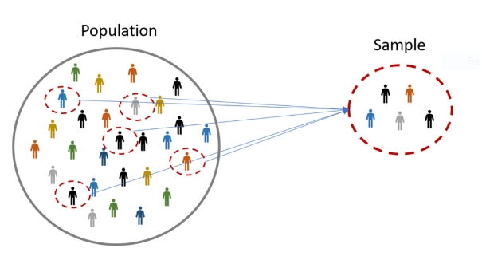
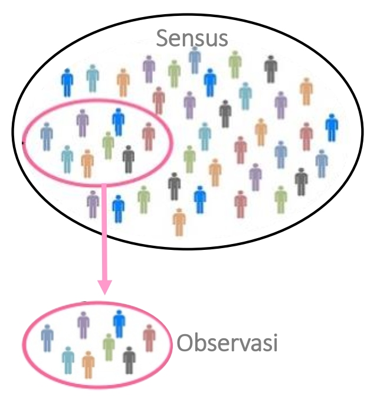
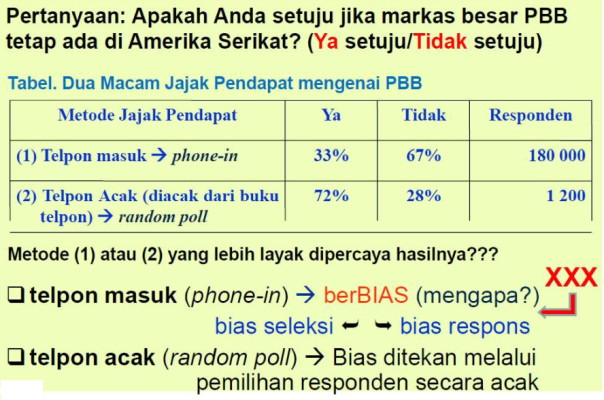
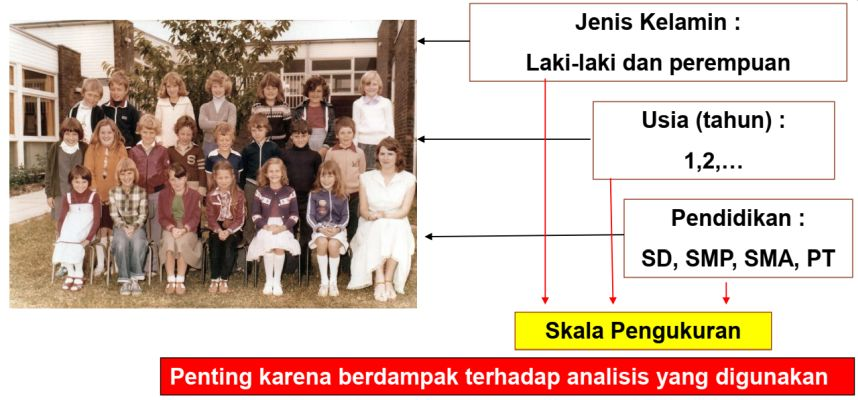
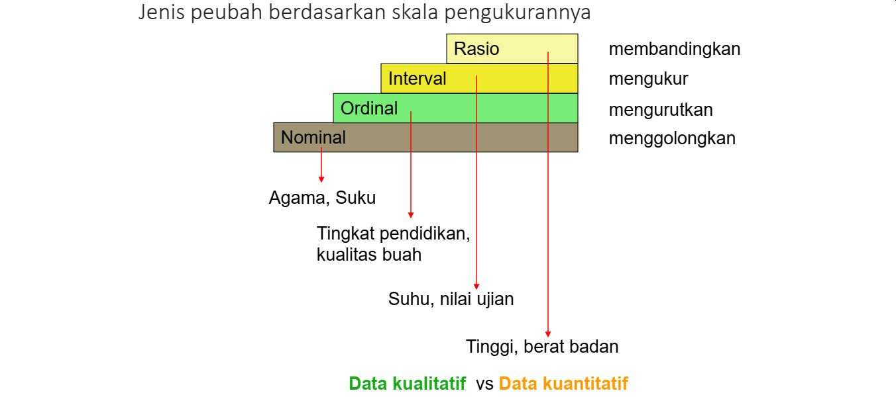

```{r xaringanExtra, echo=FALSE}
xaringanExtra::use_xaringan_extra(c("tile_view", "animate_css", "tachyons"))
```

```{r xaringan-panelset, echo=FALSE}
xaringanExtra::use_panelset()
```

```{r xaringan-scribble, echo=FALSE}
xaringanExtra::use_scribble()
```

```{r xaringan-logo, echo=FALSE}
xaringanExtra::use_logo(
  image_url = "Unsera.png"
)
```

```{r xaringanExtra-webcam, echo=FALSE}
xaringanExtra::use_webcam()
```

```{r xaringanExtra-search, echo=FALSE}
xaringanExtra::use_search(show_icon = TRUE)
```


.pull.center[

# Pengajar

]

.pull-left[
.pull.right[.blue[

## Nama :
## Pendidikan :
## Website :
## email :
## Twitter :

]
]

]

.pull-right[.purple[

## Riana Hadiana (Dian)
## S2 Statistika Terapan IPB
## https://masdian.github.io
## riana.hadiana@gmail.com
## @rianahadiana

]
]


---

.pull-left[

# .purple[**Outline**]

- ## Pendahuluan<br><br>
- ## Kontrak Perkuliahan<br><br>
- ## Statistik dan Statistika

]

.pull-right[


]

---

class: center, middle, inverse

# .red[**MENGAPA**]
# **kita harus**
# **belajar**
# .purple[**STATISTIKA**]
# **????**

---
.pull.center[
# **Business**
]

.pull-left[


]

.pull-right[

## analyze results of marketing studies about new products, to help predict sales, and to measure employee performance

]

---

.pull.center[
# **Finance**
]

.pull-left[
.pull.right[

<br><br><br>

## study .red[**stock returns**] and .green[**investment opportunities**]

]
]

.pull-right[


]

---

.pull.center[
# **Medical**
]

.pull-left[

]

.pull-right[

<br><br>

## evaluate whether .brown[**new ways**] to treat disease are better than .red[**existing ways**]

]
---

.pull.center[
# **Politics**
]

.pull-left[
.pull.right[

<br><br>

## .purple[predicting an election] <br> using an .red[**Exit Poll**] or .red[**Quick Count**]

]
]

.pull-right[


]

---

background-image: url("gb_003.jpg")
background-size: cover

---

background-image: url("gb_004.jpg")

---

background-image: url("gb_005.jpg")

---

background-image: url("gb_006.jpg")

---

background-image: url(gb_007.jpg)

class: center, bottom, inverse

# .red[**Understanding statistics can help you make better choices**]


---

class: center, middle, inverse

# Kontrak Perkuliahan

---

.pull.center[

# Tata Tertib Perkuliahan

]

- ## Toleransi waktu keterlambatan .red[15 menit].
- ## Berpakaian dan berperilaku sopan sesuai dengan aturan di Unsera
- ## Tidak ada ujian susulan kecuali bagi mahasiswa yang sakit atau menjalankan tugas institusi dan dibuktikan dengan surat keterangan dari fakultas/universitas
- ## Mahasiswa dengan tingkat .red[kehadiran kurang dari 80% tidak diperkenankan untuk mengikuti UAS].


---

### **Deskripsi Mata Kuliah**

> Mata kuliah ini menjelaskan prinsip-prinsip dasar metode statistika dan
beberapa metode analisis sederhana yang dapat diterapkan pada berbagai
bidang terapan, seperti Pertanian, Biologi, Sosial, Bisnis, dan sebagainya.


### **Standar Kompetensi**

> Setelah mengikuti mata ajaran ini selama satu semester, mahasiswa dapat
menjelaskan prinsip-prinsip dasar metode statistika, dan dapat menerapkan
beberapa metode statistik sederhana untuk menganalisis data

---

.pull.center[
## **Topik**
]

.pull-left[

### 1. Pendahuluan
### 2-3. Deskripsi Data
### 4. Konsep Dasar Peluang dan Peubah Acak
### 5. Sebaran Peluang Peubah Acak
### 6-7. Sebaran Penarikan Contoh


]

--
.pull-right[

### 8-9. Pendugaan Parameter
### 10-11. Pengujian Hipotesis
### 12. Analisis Korelasi dan Regresi Linear Sederhana
### 13-14. Materi Tambahan

]

---

.pull.center[
# Materi sebelum UTS
]

.panelset[
.panel[.panel-name[Week 01]

1. Pengertian statistik dan statistika
1. Statistika deskriptif dan inferensia: Induksi vs Deduksi
1. Peubah dan macam-macam peubah
1. Skala pengukuran (nominal, ordinal, interval, rasio)
1. Ilustrasi statistika dalam penelitian
1. Contoh acak dan penarikan contoh acak sederhana
1. Percobaan vs studi observasional


]

.panel[.panel-name[Week 02]

1. Penyajian data dalam bentuk tabel (tabel sebaran frekuensi, tabel kontingensi)
1. Penyajian data dalam bentuk grafik (diagram batang, diagram lingkaran, diagram titik, diagram dahan daun, histogram)

]

.panel[.panel-name[Week 03]

1. Ukuran pemusatan data (modus, median, kuartil, mean)
1. Ukuran penyebaran data (jangkauan, jangkauan antar kuartil, variansi, simpangan baku)
1. Diagram kotak garis


]

.panel[.panel-name[Week 04]

1. Ruang contoh dan kejadian
1. Permutasi dan kombinasi
1. Peluang (aksiomatik dan frekuensi relatif)
1. Peluang bersyarat
1. Menghitung peluang suatu kejadian
1. Penarikan contoh acak (dengan pemulihan dan tanpa pemulihan)
1. Kejadian bebas dan kaidah penggandaan
1. Dalil Bayes


]

.panel[.panel-name[Week 05]

1. Pengertian dan tipe peubah acak
1. Karakteristik peubah acak (diskrit dan kontinu)
1. Sebaran peluang diskrit (Bernoulli, Binomial, Poisson)
1. Sebaran peluang kontinu (Uniform, Normal)


]

.panel[.panel-name[Week 06]

1. Penarikan contoh dari populasi Normal
1. Nilai harapan dan ragam penarikan contoh


]

.panel[.panel-name[Week 07]

Review materi

]
]

---
.pull.center[
# Materi sesudah UTS
]

.panelset[
.panel[.panel-name[Week 08]

1. Pengertian pendugaan (penduga tak bias dan penduga terbaik)
1. Penduga titik dan penduga selang (interval)
1. Ukuran contoh dengan tingkat ketelitian tertentu
1. Penduga selang selisih rataan dua populasi saling bebas
1. Penduga selang selisih rataan dua populasi tidak saling bebas (data berpasangan)


]

.panel[.panel-name[Week 09]

1. Penduga titik dan penduga selang untuk proporsi
1. Penduga selang untuk selisih proporsi dua populasi


]

.panel[.panel-name[Week 10]

1. Prinsip pengujian hipotesis
1. Galat jenis I dan galat jenis II
1. Tahapan uji hipotesis"

]

.panel[.panel-name[Week 11]

1. Uji hipotesis untuk rataan 1 populasi
1. Uji hipotesis untuk selisih rataan 2 populasi saling bebas
1. Uji hipotesis untuk selisih rataan 2 populasi tidak saling bebas (data berpasangan)
1. Uji hipotesis untuk proporsi 1 populasi
1. Uji hipotesis untuk selisih proporsi 2 populasi"


]

.panel[.panel-name[Week 12]

1. Prinsip korelasi
1. Uji hipotesis untuk korelasi


]

.panel[.panel-name[Week 13]

1. Pengertian regresi linier sederhana
1. Pendugaan parameter regresi
1. Uji hipotesis parameter regresi
1. Koefisien determinasi

]

.panel[.panel-name[Week 14]

1. Anova - satu faktor
1. Uji asosiasi Chi-Square

]

]

---

.pull.center[
# **Referensi**
]

- ## [Agresti & Franklin (2013). The Art and Science of Learning from Data](https://www.libs.uga.edu/reserves/docs/main-spring2017/lutz-stat6220/agresti%20&%20franklin%203e.pdf)
- ## J. Supranto (2008). Statistik: Teori dan Aplikasi
- ## Pustaka lain yang relevan

---
class: inverse, center, middle

# .red[**Statistik**] **dan .green[Statistika]**

---

class: center, middle

# .green[**Statistika**] **itu .red[apa?]**

---

.pull-left[

<br>
# Perhatikan kasus berikut:

]

.pull-right[

<br><br><br>
# .purple[Konsultan ingin mengetahui persepsi konsumen terhadap suatu produk di Kota A]
]

.pull.center[

<br><br><br>
# .red[**Bagaimana caranya?????**]

]

---

background-image: url("gb_008.jpg")

---

class: middle

.pull.right[

# **.purple[Statistics is the] .red[art] and .red[science] of**
# **designing studies .purple[and] analyzing the data**
# **.purple[that those studies produce.]**

]

---

class: middle

.pull.right[

# **.purple[Its ultimate goal is] .red[translating data] into**
# **knowledge and understanding of the**
# **world around us.**

]

---

.pull.center[

# **Definisi**

]

.bg-washed-green.b--dark-green.ba.bw2.br3.shadow-5.ph4.mt5[

## Statistika (*Statistics*)

> ###Ilmu yang mempelajari seluk beluk data melalui tahap mengumpulkan data, meringkas dan menyajikan data, menganalisis data, dan menarik kesimpulan

## Statistik (*Statistic*)

> ### Informasi yang umumnya berupa bilangan (angka) yang dihasilkan oleh metode statistika

]

---

background-image: url("gb_009.jpg")

---

background-image: url("gb_010.jpg")

---

background-image: url("gb_011.jpg")

.pull.center[

# **Ruang Lingkup .purple[Statistika]**

]

---

background-image: url("gb_012.jpg")

.pull.center[

# **Contoh Kasus .purple[(1)]**
Studi untuk mengetahui ICT Literacy masyarakat Kota Bogor.

]

---

background-image: url("gb_013.jpg")

---

.pull.center[

# **Contoh Kasus .purple[(2)]**

]

<br><br><br><br><br>

.pull.center[
## Berapa jam rata-rata orang menonton televisi dalam satu hari?
]


---

background-image: url("gb_014.jpg")

---

background-image: url("gb_01.jpg")

---

background-image: url("gb_015.jpg")

---

.pull.center[

# **Definisi Beberapa Istilah**

]

.pull-left[

#### Populasi
>Keseluruhan pengamatan yang diteliti dan akan ditarik kesimpulan

#### Contoh (Sampel)
>Himpunan bagian yang mewakili populasi

#### Parameter
> Suatu karakteristik yang menjelaskan ciri dari populasi

#### Statistik (Penduga Paramater)
> Suatu nilai yang menjelaskan ciri dari contoh

]

.pull-right[

#### Statistika Deskriptif
> Metode yang berkaitan dengan pengumpulan dan penyajian data sehingga memberikan informasi yang berguna

#### Statistika Inferensia
> Metode yang berhubungan dengan analisis data (contoh) untuk kemudian sampai pada penarikan kesimpulan keseluruhan data Peubah (Variabel) Ciri dari suatu objek yang diamati

#### Peubah (Variabel)
> Ciri dari suatu objek yang diamati

]


---

.pull.center[

# **Mengapa Perlu Belajar .red[Statistika]?**

]

--

## Ungkapan: “**.red[without data], you are just another person with an .red[opinion]**”

--

## **.red[Logika saja bisa salah] kalau tidak dikonfrontasi dengan data**

--

## Masyarakat melek informasi (modern) perlu:
- Mengambil sari-pati dari informasi yang ada di dalam tabel, diagram dan grafik.
- Memahami argumen berbasis data, BUKAN asal bunyi (asbun)
- Memahami bagaimana cara mengumpulkan data, menyajikan data, menganalisis data dan cara mengambil kesimpulan

---

.pull.center[

# **Mengapa .red[Statistika] perlu digunakan?**

]

.pull-left[

### Keterbatasan waktu
### Keterbatasan tenaga dan pikiran
### Keterbatasan dana
### .... dst


]

--

.pull-right[

.pull.center[
## .red[**Sampling**]
]


]


---

.pull.center[

# **Pengumpulan Data**

]

--

.bg-washed-green.b--dark-green.ba.bw2.br3.shadow-5.ph4.mt5[

## Kasus 1

Sebuah perusahaan ingin mengetahui preferensi konsumen terhadap jenis aplikasi pembiayaan di suatu daerah.

]

--

.bg-washed-green.b--dark-green.ba.bw2.br3.shadow-5.ph4.mt5[

## .red[Percobaan]

Respon belum tersedia, sehingga diperlukan suatu perlakuan untuk memunculkan respon

]

---

.pull.center[

# **Pengumpulan Data**

]

--

.bg-washed-green.b--dark-green.ba.bw2.br3.shadow-5.ph4.mt5[

## Kasus 2

Peneliti ingin mengetahui persepsi konsumen terhadap suatu produk mie
instan pada Kota A.

]

--

.bg-washed-green.b--dark-green.ba.bw2.br3.shadow-5.ph4.mt5[

## .red[Survey]

Respon sudah tersedia, peneliti hanya berupaya untuk menggali/ memperoleh respon tersebut

]

---

.pull.center[

# **Pengumpulan Data**

]

.pull-left[

.bg-washed-green.b--dark-green.ba.bw2.br3.shadow-5.ph4.mt5[

### **Sensus**

Pengambilan keseluruhan data pada populasi

]

.bg-washed-green.b--dark-green.ba.bw2.br3.shadow-5.ph4.mt5[

### **Observasi**
Pengambilan data dengan cara mengamati objek yang diteliti

]

]

--

.pull-right[


]

---

.pull.center[

# **Kesalahan dalam Pengumpulan Data**

]

.pull-left[


]

--

.pull-right[

### Bias dalam jajak pendapat melalui telepon
1. Bias seleksi
1. Bias dari nomor telepon yang tidak terdaftar
1. Bias dari nomor telepon yang tidak dijawab
1. Bias respons

### Kesalahan populasi sasaran

### Pendapat yang berubah-ubah
Informasi yang diberikan sesuai dengan waktu kejadian

]

---
.pull.center[

# **Peubah (Variabel)**

]

sebuah karakteristik yang dapat mengandung BERBAGAI NILAI ANTAR OBJEK yang diamati baik dari contoh maupun populasi<br><br>



---

.pull.center[

# **Peubah (Variabel)**

]



---

.pull.center[
#**.red[Tugas]: .blue[Getting to Know The Class]**
]

Buatlah database kelas Anda yang berisi informasi berikut:
1. Tinggi Badan (cm)
1. Jenis Kelamin (L/P)
1. Tanggal Lahir (yyyy/mm/dd)
1. Jarak dari tempat tinggal ke ruang kuliah Statistik (km, gunakan 2 angka di belakang koma)
1. Seberapa tertarik Anda mengikuti kuliah Statistik? (Sangat tidak tertarik, Tidak tertarik, Cukup Tertarik, Sangat Tertarik)
1. Berapa menit setiap harinya (rata-rata) Anda menghabiskan waktu untuk browsing internet?
1. Berapa menit setiap harinya (rata-rata) Anda menghabiskan waktu untuk menonton TV?
1. Berapa jam setiap minggunya (rata-rata) Anda menghabiskan waktu untuk berolahraga?

---

class: inverse, middle, center

# Thank you
# See you next week!

